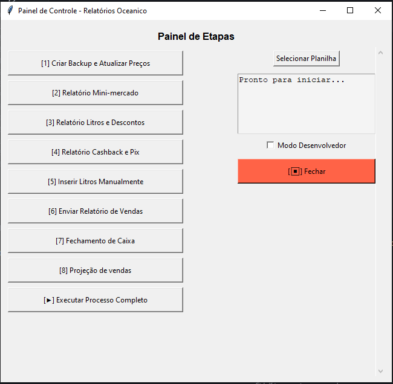

# ⛽ OceanicDesk - Oceanic Gas Station Automation

Modern and robust automation system for administrative routines at a gas station.

[🇺🇸 English Version](README.md) | [🇧🇷 Versão em Português](PT-BR-README.md)


<br>

<p align="center">
  <!-- Add your project preview image below -->
  
</p>

<br>

## 📋 Table of Contents

* [About](#-about)
* [Technologies Used](#-technologies-used)
* [Visual Alert System](#-visual-alert-system)
* [How to Run](#-how-to-run)
* [Testing](#-testing)
* [Documentation](#-documentation)
* [License](#-license)
* [Contact](#-contact)

<br>

## 📖 About

**Oceanic Gas Station Automation** is a Python desktop application designed to automate and optimize daily administrative and operational tasks at a gas station. It reduces manual work, minimizes errors, and speeds up processes like report generation, spreadsheet handling, backups, integration with management systems (AutoSystem and EMSys3), and email communication.

**Key features:**
*   **Intuitive GUI (Tkinter):** Simple interface with dedicated buttons and log panel.
*   **Visual Alert System:** Modern, non-intrusive alerts with fade animations and dark theme.
*   **Automation with External Systems (pyautogui):** Simulates keyboard/mouse to interact with AutoSystem and EMSys3.
*   **Advanced Excel Handling (openpyxl, pandas):** Reads, writes, and processes Excel files for financial and sales data.
*   **Automated Email Reports:** Sends daily reports to stakeholders.
*   **Automatic Spreadsheet Backup:** Timestamped backups for data safety.
*   **Developer Mode:** Detailed, scrollable logs for debugging.
*   **Daily Log Files:** All operations are logged for auditing.
*   **Automated Testing:** Unit tests ensure reliability.
*   **Thread-Safe Operations:** Safe concurrent operations with visual feedback.

<br>

## 💻 Technologies Used

- Python 3.10+
- Tkinter
- pandas
- openpyxl
- pyautogui
- pywin32
- python-dotenv

<br>

## 🔔 Visual Alert System

The OceanicDesk features a modern visual alert system that provides real-time feedback for all operations:

### ✨ Features
- **Dark Theme**: Elegant dark interface with smooth animations
- **6 Alert Types**: Success, Error, Info, Warning, Dev, Progress
- **Smart Positioning**: Bottom-right corner with intelligent stacking
- **Thread-Safe**: Supports concurrent operations safely
- **Non-Intrusive**: 92% opacity with fade in/out animations
- **Always on Top**: Alerts remain visible over other windows

### 🎨 Alert Types
- **Success** (Green): Completed operations
- **Error** (Red): Critical failures and errors
- **Info** (Blue): General information and status
- **Warning** (Yellow): Important warnings
- **Dev** (Purple): Technical logs and debug info
- **Progress** (Cyan): Operations with progress bar

### 📍 Positioning
- **Default**: Bottom-right corner
- **Stacking**: Multiple alerts stack vertically
- **Custom**: Support for specific positioning

For detailed documentation, see [Visual Alerts Documentation](docs/ALERTAS_VISUAIS.md).

<br>

## 🛡️ Security and Best Practices

- The system requires sensitive variables (login, password, spreadsheet paths, email) to be properly filled in the `.env` file.
- If any required variable is missing, the system will display a friendly error and will not allow execution.
- File paths are checked before use to avoid unexpected failures.
- The Tesseract path can be configured via the `TESSERACT_CMD` environment variable.
- **IMPORTANT:** Never commit the `.env` file to version control as it contains sensitive information.
- All user credentials are now stored as environment variables for enhanced security.

## 🚀 How to Run

```bash
# Clone this repository
$ git clone https://github.com/gabrielcamarate/Projeto_posto.git

# Enter the project folder
$ cd Projeto_posto

# Install dependencies
$ pip install -r requirements.txt
```

Create a `.env` file in the root with your credentials:

```dotenv
# System authentication
LOGIN_SISTEMA=your_user
SENHA_SISTEMA=your_password

# Email configuration
EMAIL_REMETENTE=your_email@domain.com
SENHA_EMAIL=your_email_password
EMAIL_DESTINATARIO=recipient@domain.com

# EMSys3 user authentication
USUARIO_NILTON=NILTON.BARBOSA
SENHA_NILTON=your_nilton_password
USUARIO_ELIANE=ELIANE.MARIA
SENHA_ELIANE=your_eliane_password

# Optional: Tesseract OCR path
TESSERACT_CMD=C:\Program Files\Tesseract-OCR\tesseract.exe
```

To run the application:

```bash
python run.py
```

## 🧪 Testing

### Run All Tests
```bash
python -m unittest discover -s tests
```

### Visual Alert Tests
```bash
python tests/test_alerta_visual.py
```

### Specific Test Categories
- **Basic Alerts**: All alert types
- **Simultaneous Alerts**: Multiple alerts at once
- **Progress Alerts**: Progress bar functionality
- **Positioning**: Alert positioning tests
- **Thread Safety**: Concurrent operations
- **Bug Simulation**: Known issues reproduction

## 📚 Documentation

- **[Visual Alerts System](docs/ALERTAS_VISUAIS.md)**: Complete documentation of the alert system
- **[Portuguese README](PT-BR-README.md)**: Portuguese version of this documentation
- **[Changelog](CHANGELOG-EN.md)**: Detailed version history
- **[Build Guide](BUILD-README.md)**: Instructions for building the executable

<br>

## 📝 License

This project is private and for restricted use. Distribution, modification, or commercial use is not permitted without explicit authorization from the author.

<br>

## 📬 Contact

Made with ❤️ by Gabriel Camarate. Get in touch!

[](https://www.linkedin.com/in/gabrielcamarate/)
[](mailto:gabrielcamarate@icloud.com)
[](https://github.com/gabrielcamarate)

## 📝 Changelog

### v1.4.5 (Current)
- **Visual Alert System**: Fixed multiple simultaneous alerts issue
- **Positioning**: Moved alerts to bottom-right corner to avoid pyautogui conflicts
- **Thread Safety**: Optimized thread system and reduced exceptions
- **Performance**: Reduced excessive alerts and improved user experience
- **Hidden Window**: Main window now hidden to avoid interference

### v1.4.4
- **Visual Alert System**: Implemented modern alert system with fade animations
- **Multiple Alert Types**: Success, Error, Info, Warning, Dev, Progress
- **Smart Positioning**: Intelligent alert stacking and positioning
- **Thread-Safe**: Safe concurrent operations with visual feedback
- **Complete Integration**: Alerts integrated throughout the entire project

### v1.4.1
- Type and robustness fixes in `sistema.py` and `helpers.py` (Pyright compatibility)
- Improved error handling for Excel and environment variables
